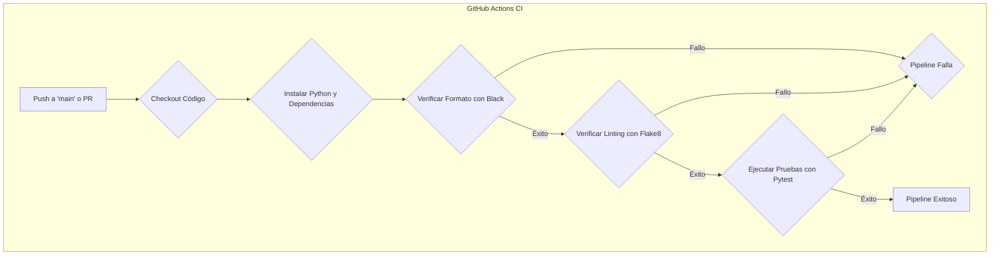

# Sistema de Gestión de Inventarios

Este proyecto implementa un sistema para la gestión de inventarios y el seguimiento de movimientos (entradas y salidas) de bienes y servicios, integrado con un clasificador presupuestario por objeto del gasto.

## Requisitos Previos

Asegúrate de tener instalados los siguientes requisitos en tu sistema:

-   **Python:** Versión 3.11 o superior.
-   **Node.js:** Versión 18 o superior.
-   **PostgreSQL:** Versión 14 o superior.
-   **Poetry (Opcional):** Una herramienta para la gestión de dependencias y empaquetado de Python. Puedes instalarlo siguiendo las instrucciones en [https://python-poetry.org/docs/](https://python-poetry.org/docs/).

## Configuración del Backend

Sigue estos pasos para configurar el entorno del backend:

1.  **Clonar el repositorio:**

## Calidad de Código y Desarrollo Local

El proyecto utiliza herramientas automatizadas para garantizar la calidad del código:
- **Black**: Formateo automático de código
- **Flake8**: Detección de errores y "code smells"
- **Pytest**: Pruebas automatizadas

**Comandos locales para prevenir fallos en CI:**
```bash
# Instalar herramientas de calidad
pip install -r backend/requirements-dev.txt

# Formatear código automáticamente
black backend/

# Verificar estándares de código
flake8 backend/

# Ejecutar pruebas
pytest backend/
```
Ejecuta estos comandos desde la raíz del proyecto antes de cada commit para evitar fallos en el pipeline de CI.

### Diagrama de Flujo del Pipeline de CI


