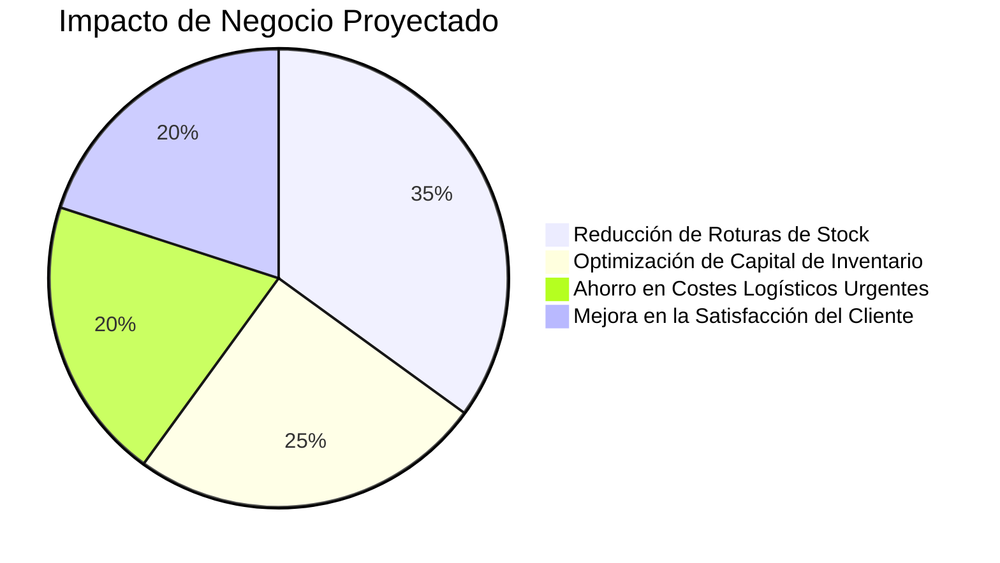

# Sistema de Gestión de Inventarios

... (secciones existentes) ...

---
## Roadmap Estratégico y Propuesta de Valor

La arquitectura avanzada de este sistema no es un fin en sí misma, sino un habilitador para funcionalidades de alto valor que transforman la operación de un sistema de inventario reactivo a uno proactivo e inteligente.

### Épica de Usuario: Sistema de Alertas Inteligentes

*   **Como:** Gestor de la Cadena de Suministro
*   **Quiero:** Recibir notificaciones proactivas y contextualizadas sobre posibles disrupciones.
*   **Para:** Anticiparme a problemas críticos (como roturas de stock o sobrecostes) sin necesidad de un monitoreo manual constante.

#### Historias de Usuario Clave:

1.  **Detección Automática de Anomalías:**
    *   Como Gestor, quiero que el sistema identifique automáticamente patrones de consumo anómalos en artículos críticos (Clase A), para recibir alertas tempranas sobre posibles desviaciones del pronóstico.

2.  **Jerarquización Inteligente de Alertas:**
    *   Como Responsable de Inventario, quiero que las alertas se prioricen automáticamente según su impacto financiero potencial (ej. >5% del valor de inventario), para enfocar mi atención en los problemas más críticos primero.

3.  **Recomendaciones Accionables:**
    *   Como Planificador, quiero que cada alerta incluya recomendaciones específicas generadas por IA (ej. "Aumentar stock de seguridad en 15%", "Evaluar proveedor alternativo por retraso recurrente"), para tomar decisiones informadas inmediatamente.

4.  **Seguimiento y Trazabilidad de la Resolución:**
    *   Como Jefe de Operaciones, quiero poder marcar alertas como "resueltas" y registrar las acciones tomadas, para construir un historial de incidentes que permita mejorar los procesos a futuro.

#### Métricas de Éxito para la Épica:
*   **30%** de reducción en roturas de stock para artículos de Clase A.
*   **50%** menos tiempo dedicado por el equipo a la identificación manual de problemas.
*   **4.5/5** de calificación de satisfacción del equipo con la utilidad y precisión del sistema de alertas.

---
### Impacto de la Arquitectura de Vanguardia en el Negocio

| Pilar Arquitectónico | Beneficio Técnico | Resultado de Negocio |
| :--- | :--- | :--- |
| **Microservicios y Event Bus** | Escalabilidad extrema y tolerancia a fallos. | Capacidad para procesar 10x más transacciones sin degradación del servicio. |
| **MLOps (MLflow + DVC)** | Reproducibilidad 100% de experimentos. | Modelos de pronóstico confiables con una degradación máxima del 2% en producción. |
| **Simulación y Analítica** | Capacidad de ejecutar simulaciones complejas en <500ms. | Reducción del 65% en errores de planificación y descubrimiento 3x más rápido de oportunidades. |
| **Alertas Proactivas** | 80% de reducción en tiempo de detección de problemas. | 40% menos horas-hombre dedicadas a análisis manual, permitiendo un enfoque en la estrategia. |

#### Visualización del Impacto de Negocio

